```mermaid
graph TD
    A[Reconnaissance] -->|OSINT| B[Target Analysis]
    B --> C{Attack Vector}
    C -->|Web| D[Application Layer]
    C -->|Network| E[Infrastructure]
    C -->|Social| F[Human Element]
    D --> G[Exploitation]
    E --> G
    F --> G
    G --> H[Post Exploitation]
    H --> I[Documentation]
    style A fill:#001F3F,stroke:#00FF00
    style B fill:#001F3F,stroke:#00FF00
    style C fill:#001F3F,stroke:#00FF00
    style D fill:#001F3F,stroke:#00FF00
    style E fill:#001F3F,stroke:#00FF00
    style F fill:#001F3F,stroke:#00FF00
    style G fill:#001F3F,stroke:#00FF00
    style H fill:#001F3F,stroke:#00FF00
    style I fill:#001F3F,stroke:#00FF00
```

<div align="center">

<!-- Animated Matrix-style Banner -->


<!-- Animated Terminal Effect -->
[](https://git.io/typing-svg)

<!-- Digital Grid Animation -->


<!-- Profile Badges with Neon Effect -->
<div style="background-color: #000000; padding: 20px; border-radius: 10px; border: 1px solid #00FF00;">
  
  
  
</div>

<!-- TryHackMe Profile -->
<br>
<a href="https://tryhackme.com/">
  
</a>

</div>

<!-- Terminal Style Introduction -->
```shell
┌──(root💀kali)-[~/profile]
└─# cat introduction.txt

[*] OPERATIONAL SECURITY SPECIALIST
[*] THREAT HUNTER & VULNERABILITY RESEARCHER
[*] RED TEAM OPERATOR & EXPLOIT DEVELOPER
```

<!-- Matrix-style Skill Section -->
<details>
<summary>🖥️ Technical Matrix</summary>
<div align="center">

```txt
┌─────────────────────────[ SKILL MATRIX ]─────────────────────────┐
│                                                                  │
│ OFFENSIVE OPERATIONS        DEFENSIVE KNOWLEDGE      DEVELOPMENT │
│ ────────────────────       ──────────────────      ─────────── │
│ ◉ Red Team Ops             ◉ Threat Intel          ◉ Python    │
│ ◉ Exploit Dev              ◉ Malware Analysis      ◉ Rust      │
│ ◉ Web Security             ◉ Incident Response     ◉ Go        │
│ ◉ Network Attacks          ◉ Digital Forensics     ◉ Assembly  │
│ ◉ Social Engineering       ◉ Reverse Engineering   ◉ C/C++     │
│                                                                  │
└──────────────────────────────────────────────────────────────────┘
```

<!-- Neon Stats Cards -->


</div>
</details>

<!-- Arsenal Section -->
<details>
<summary>⚔️ Offensive Arsenal</summary>

```python
class OffensiveArsenal:
    def __init__(self):
        self.attack_vectors = {
            "Web_Attacks": [
                "Custom HTTP Request Smuggling",
                "Advanced XSS Chains",
                "GraphQL Exploitation",
                "OAuth Flow Manipulation"
            ],
            "Network_Attacks": [
                "Advanced Pivoting Techniques",
                "Custom Protocol Exploitation",
                "Zero-day Development",
                "C2 Infrastructure"
            ],
            "Custom_Tools": [
                "Automated Vulnerability Scanner",
                "Custom Malware Framework",
                "Red Team Reporting Suite",
                "Exploit Chain Automator"
            ]
        }
    
    def execute_operation(self, target):
        for vector in self.attack_vectors:
            if self.recon(target):
                self.exploit()
                self.maintain_access()
                self.collect_evidence()
```

</details>

<!-- Active Operations -->
<details>
<summary>🎯 Active Operations</summary>



</details>

<!-- Research Papers -->
<details>
<summary>📚 Security Research</summary>

<div align="center">

| Type | Title | Status | Impact |
|:----:|:------|:------:|:------:|
| 🔥 Zero-Day | Advanced Supply Chain Attack | `[Disclosed]` | Critical |
| 🌐 Web Security | OAuth2.0 Implementation Flaws | `[Published]` | High |
| 🔒 Encryption | Novel Cryptographic Attack | `[Research]` | Medium |
| 🛡️ Defense | AI-Based Threat Detection | `[Ongoing]` | High |

</div>
</details>

<!-- Terminal Quote -->
```shell
┌──(root💀kali)-[~/mindset]
└─# cat security_mindset.sh

while true; do
    enumerate_everything
    trust_nothing
    verify_assumptions
    document_findings
    share_knowledge
done
```

<!-- Social Links with Neon Effect -->
<div align="center">

### [💻 Connect on the Dark Side]

[](https://linkedin.com/in/YOUR_LINKEDIN)
[](https://twitter.com/YOUR_TWITTER)
[](https://YOUR_BLOG.com)
[](https://app.hackthebox.com/profile/YOUR_HTB_ID)

<!-- Matrix-style Footer -->


</div>
